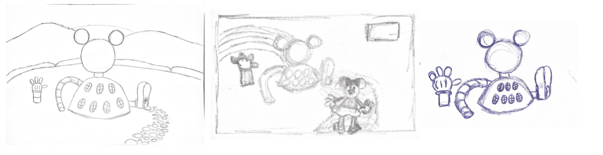
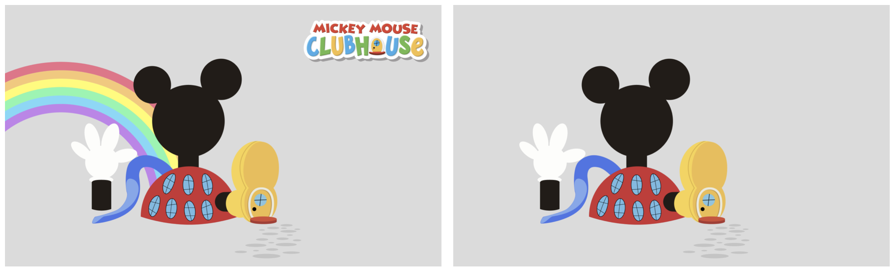
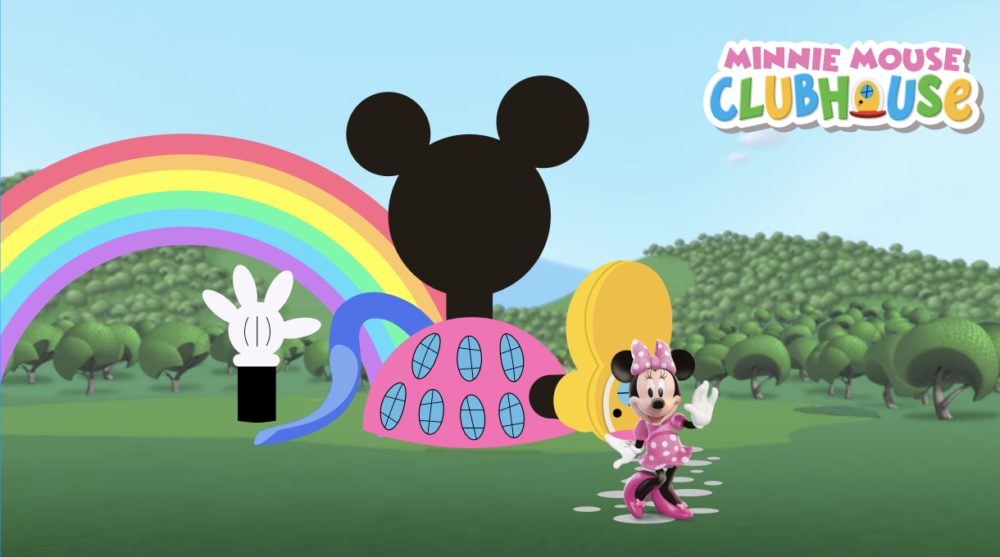
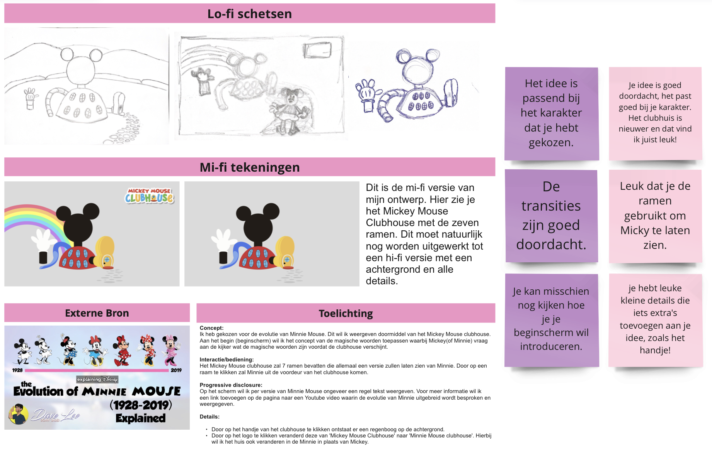
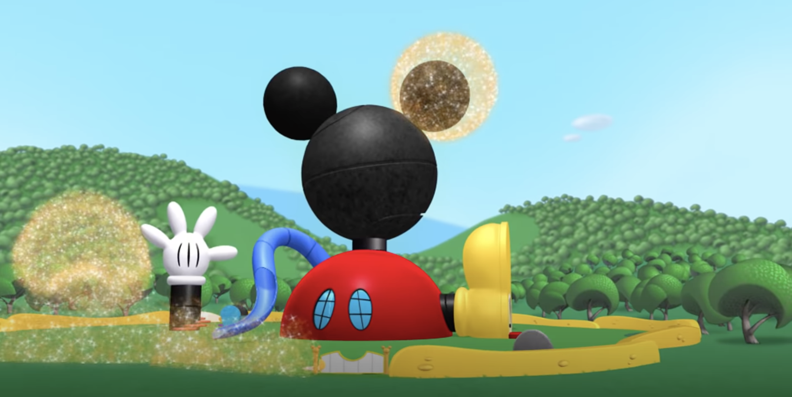
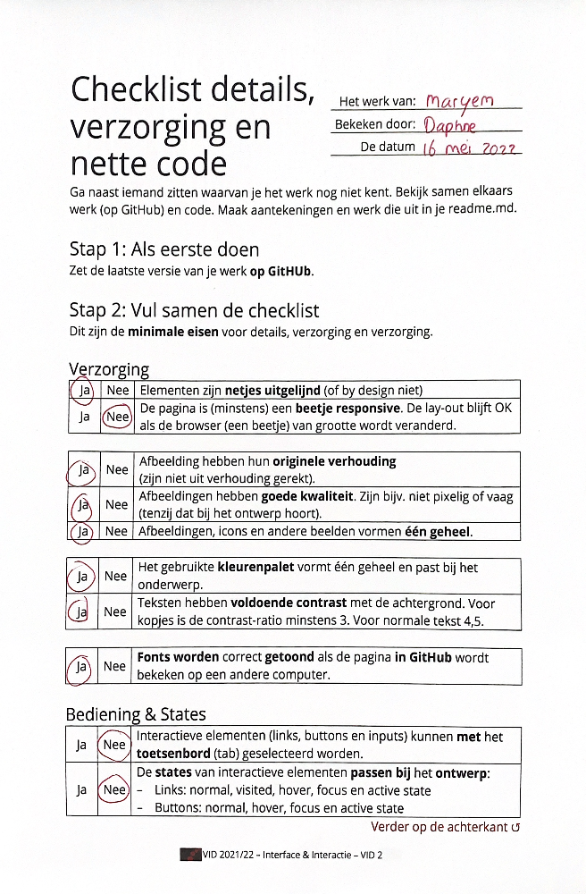
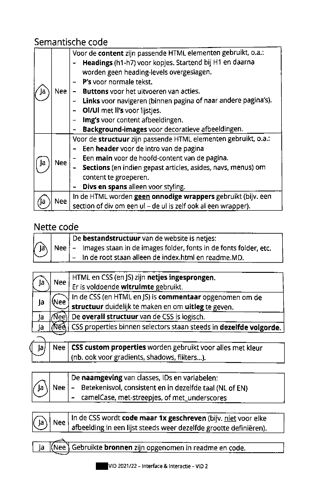
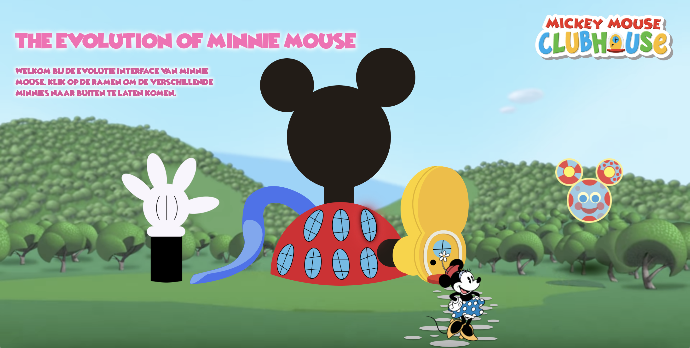
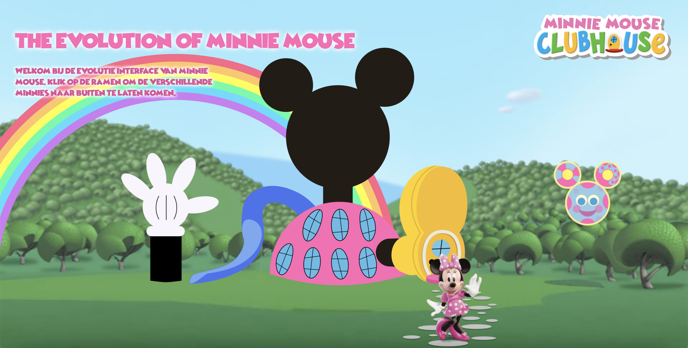

# Procesverslag
Markdown is een simpele manier om HTML te schrijven.  
Markdown cheat cheet: [Hulp bij het schrijven van Markdown](https://github.com/adam-p/markdown-here/wiki/Markdown-Cheatsheet).

Nb. De standaardstructuur en de spartaanse opmaak van de README.md zijn helemaal prima. Het gaat om de inhoud van je procesverslag. Besteedt de tijd voor pracht en praal aan je website.

Nb. Door *open* toe te voegen aan een *details* element kun je deze standaard open zetten. Fijn om dat steeds voor de relevante stuk(ken) te doen.

## Jij

### Ontwerper:
Maryem Bekkali

#### Je startniveau:
Mijn startniveau is: Blauw/Rood misschien Paars 🤷🏽‍♀️.

Dit is niet de eerste keer voor mij dat ik ga coderen, maar er is wel veel weg gezakt omdat ik het niet vaak doe. Begrijpen gaat vaak wel, maar om zelf te bedenken hoe ik iets moet doen vind ik nog lastig.

# Je plan

  

Concept:
Ik heb gekozen voor de evolutie van Minnie Mouse. Dit wil ik weergeven doormiddel van het Mickey Mouse clubhouse.
Aan het begin (beginscherm) wil ik het concept van de magische woorden toepassen waarbij Mickey(of Minnie) vraag aan de kijker wat de magische woorden zijn voordat de clubhouse verschijnt.

Interactie/bediening:
Het Mickey Mouse clubhouse zal 7 ramen bevatten die allemaal een versie zullen laten zien van Minnie. Door op een raam te klikken zal Minnie uit de voordeur van het clubhouse komen.

Progressive disclosure:
Op het scherm wil ik per versie van Minnie Mouse ongeveer een regel tekst weergeven. Voor meer informatie wil ik een link toevoegen op de pagina naar een Youtube video waarin de evolutie van Minnie uitgebreid wordt besproken en weergegeven.

Details:
Door op het handje van het clubhouse te klikken ontstaat er een regenboog op de achtergrond.
Door op het logo te klikken veranderd deze van 'Mickey Mouse Clubhouse' naar 'Minnie Mouse clubhouse'. Hierbij wil ik het huis ook veranderen in de Minnie in plaats van Mickey.
  

  ### De eerste versie/schets:
  
  
  

  ### Je ambitie: 
  Aan deze technieken/punten wil ik werken:
  - Tot nu toe heb ik niet echt ervaring met JavaScript. Ik wil hier beter in worden en het beter begrijpen.
  - Tijdens Webtypografie heb ik gewerkt met keyframes om animaties te maken in CSS. Dat was denk ik de eerste keer dat ik daarmee werkte. Ik wil tijdens deze opdracht keyframes gebruiken voor mijn animaties om dit beter onder de knie te krijgen.
  - Positioneren met CSS vind ik nog best lastig. Vooral grid begrijp ik nog niet zo goed. Dit wil ik minimaal 1 keer gebruiken voor mijn interface om er mee te oefenen.
 

## Voortgang/Feedback 1

  
Mijn bevindingen + wijzigingen

  ### Feedback:
  Voor de les van dinsdag 10 mei had ik mijn concept op Miro gezet. Omdat ik deze les had gemist en mijn concept nog niet duidelijk was op Miro heb ik dit eerst aangevuld voordat ik feedback ben gaan vragen. Ik heb feedback van Senna en Daphne gekregen. Eigenlijk heb ik bijna alleen maar positieve feedback gehad.
  1. Het idee past bij het karakter.
  2. De transities zijn goed doordacht.
  3. Leuk idee om de ramen te gebruiken voor de verschillende versies van Minnie Mouse.
  4. Leuke details die iets extra's toevoegen aan het concept zoals het handje met de regenboog.

### Bevinding 1:
  'Je kan misschien nog kijken hoe je je beschinscherm wil introduceren.'

  #### oplossing:
  Hier heb ik nog even over nagedacht. Ik had het idee om een beginscherm te maken waarbij Minnie Mouse om het magische woord vraagt voordat het clubhuis tevoorschijn komt. Dit gebeurt namelijk ook in de introductie van de tekenfilm. Ik heb uiteindelijk geen tijd meer over gehad om dit uit te werken.

  

## Voortgang/Feedback 2

  
Mijn bevindingen + wijzigingen

  
  ### Bevinding 1:
  Mijn interface was nog niet responsive.

  #### oplossing:
  Ik merkte dat mijn clubhuis wel responsive was en alle andere elementen niet. Ik ben in mijn code gaan kijken wat ik daar anders had gedaan. Ik zag dat ik voor de positie van het clubhuis vw gebruikte en voor de rest em. Dit heb ik voor de andere elementen dan ook aangepast. Verder heb ik voor mijn regenboog media queries gebruikt. Hier heb ik drie breakpoints voor gemaakt.

  ### Bevinding 2:
  Mijn buttons en link hadden nog geen states.

  #### oplossing:
  Voor de buttons en link heb ik een hover, focus en active state gemaakt. Voor de hover state heb ik gebrobeerd het glitter effect van het Minnie Mouse Clubhouse na te maken. Hiervoor heb ik een goude drop shadow gebruikt. Voor de focus state heb ik een donkere schaduw gemaakt. Door met tab op het toetsenbord te klikken komt deze te voorschijn. Als de gebruiker op eter klikt wordt de knop geactiveerd. Tenslotte heb ik voor de active state de knop iets vergroot.

  

  ### Bevinding 3:
  Mijn css code was nog niet netjes gesorteerd.

  #### oplossing:
  Ik heb alle code die bij hetzelfde element hoort onder elkaar gezet zodat dit makkelijk te vinden is tijden het coderen en zodat het makkelijk te lezen is. Verder heb ik voldoende ruimte gelaten tussen verschillende onderdelen. Verder heb ik de css properties binnen de selector steeds in dezelfde volgorde gezet.

  ### Bevinding 4:
  De gebruikte bronnen worden niet opgenomen in mijn readme.

  #### oplossing:
  Ik heb alle gebruikte bronnen in een logisch overzicht in mijn readme opgenomen. Deze heb ik onderverdeeld in afbeeldingen, font, code, cursor en externe link en inspiratie.

  
  

## Voortgang/Feedback 3

  
Mijn bevindingen + wijzigingen (minimaal 5)

  ### Bevinding 1:
  Je zou nog een muziekje kunnen toevoegen.

  #### oplossing:
  Dit wilde ik toevoegen aan het beginscherm, maar daar had ik geen tijd meer voor.

  ### Bevinding 2:
  Je zou nog jaartallen kunnen toevoegen bij elke nieuwe minni mouse.

  #### oplossing:
  Dit heb ik geprobeerd op te zoeken, maar ik kon niet vinden wat de jaartallen precies waren. Ik heb hiervoor een h2 element toegevoegd waarin staat dat het vanaf 1928 tot 2019 is.

## Reflectie

  
Mijn eindresultaat & persoonlijke ontwikkeling

  ### Je uitkomst - karakteristiek screenshot(s):
  
  

  ### Dit ging goed/Heb ik geleerd: 
  Ik begrijp JavaScript nu een stuk beter. Het lukt me om een knop te gebruiken om vervolgens iets in het scherm te laten veranderen. Ik heb ook veel geleerd over animeren met keyfames. Ik vond de scructuur van de lessen erg fijn en goed werken. Het was fijn om vragen te stellen en we kregen goede hulp.

  ### Dit was lastig/Is niet gelukt:
  Ik heb een aantal dingetjes waar in nog aan wilde werken maar waar ik niet aantoe ben gekomen. Ik wilde namelijk nog een beginscherm toevoegen aan mijn interface. Hier wilde ik ook een geluidje aan toevoegen. Ook wilde ik de schaduw van de link nog wat aanpassen zodat deze op z'n plek bleef maar iets groter werd als de link dichterbij kwam en iets kleiner als die wat meer omhoog ging. Verder werkt de schaduw in de roze versie van de link niet. Hier wilde ik ook nog naar kijken, maar had ik geen tijd meer voor.

## Bronnenlijst

Afbeeldingen:
1. https://gigiburris.com/pages/disney-x-gigi-burris
2. https://mungfali.com/post/710B2DA213141EC52BB21FF59CD0A7AC61A51662
3. https://mungfali.com/post/1B904B912A8F181CCBD253BFC73D2AC7E919B85E
4. https://mungfali.com/post/B35D3926E22F68658E2E5A1C4E36B6282D1813AF
5. https://mungfali.com/post/A946AD8AF9BD8D2C6484DDE528EC92CDF0CD8045
6. https://mungfali.com/post/835522B57332ED87E50B40BC03FA41C889B11BBD
7. https://mungfali.com/post/5779C735C6AA2516D5035ADDFD695968A5236DFE
8. https://en.wikipedia.org/wiki/Mickey_Mouse_Clubhouse
9. https://www.youtube.com/watch?v=pY7hFRg2jvw&t=317s

Font:
1. https://www.dafont.com/wicked-mouse.font?text=Minnie+mouse

Code:
1. https://codepen.io/shooft/pen/WNMpaVg
2. https://codepen.io/maryembekkali/pen/XWZjXyr

Externe link en inspiratie:
1. https://www.youtube.com/watch?v=3BZ05HSm8_Y
2. https://disney.fandom.com/wiki/Minnie_Mouse_Through_the_Years
3. https://www.youtube.com/watch?v=pY7hFRg2jvw&t=124s

Cursor:
1. https://www.cursors-4u.com/cursor/2009/01/31/disney-minnie-mouse-3.html
2. https://www.cursors-4u.com/cursor/2009/04/29/one-spark-pink-bow-tie-ribbon.html

